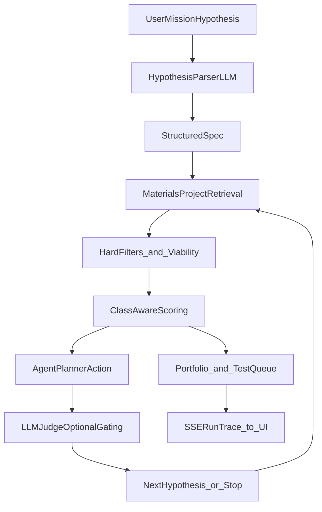

# Mantle AI

Team name : Team PACS  
Team members : Aayusha Hadke, Bismanpal Anand, Celine John Philip, Prasannadata Kawadkar  
Track : Autonomous Labs

## What We Built

Mantle AI is an **agentic AI system for computational materials discovery** built to reduce strategic dependence on fragile mineral supply chains.  
It translates mission-level engineering needs into structured search constraints, executes iterative retrieval and scoring against Materials Project data, and produces a transparent, lab-oriented decision package with uncertainty and test planning.

Instead of acting like a one-shot chatbot, Mantle AI behaves like a research copilot with memory, constrained planning, and explicit convergence logic.

## Datasets and APIs Used

- **Materials Project API (`mp-api`)**: primary computational materials dataset (thermodynamic/electronic summary fields)
- **Materials Project REST fallback (`api.materialsproject.org`)**: HTTP fallback path when client compatibility fails
- **Google Gemini API (`google-genai`)**: parsing, iterative reasoning, hypothesis generation, and portfolio synthesis
- **Ollama-compatible API** (optional): local/self-hosted model provider path for planner/judge/reasoning calls

---

## Why Mantle AI Exists

High-performance defense and aerospace systems often rely on materials whose supply chains are geopolitically concentrated.  
Mantle AI addresses this by creating a **computational screening layer** before expensive wet-lab cycles:

- converts ambiguous problem statements into machine-usable constraints
- searches and ranks candidate materials under hard safety and practicality filters
- traces why options were selected, rejected, or deferred
- outputs a realistic lab-ready test queue for next-step validation

The result is a faster, more auditable path from mission need to experimentally testable candidates.

---

## Product Story

You start with a plain-English mission:

> "Find a high-temperature solid-state material for aerospace components without cobalt or rare earth elements."

Mantle AI then:

1. parses intent into structured constraints (`allowed_elements`, `banned_elements`, `material_class`, viability requirements)
2. performs retrieval from Materials Project with fallback query strategies
3. applies class-aware hard filters and practical constraints
4. scores candidates using domain-aware, weighted heuristics
5. runs an iterative agent loop (`retrieve_more`, `refine_direction`, `stop`)
6. compiles portfolio + uncertainty + recommended experiments
7. streams a full run transcript and decision trace to the UI

---

## Core Architecture



### Key backend modules

- `criticalmat/core/loop.py`
  - iterative autonomous loop orchestration
  - convergence checks, retrieval budgeting, action planning
  - agent trace emission
- `criticalmat/materials/search.py`
  - retrieval from Materials Project (`mp-api` + HTTP fallback)
  - viability filters, class relevance checks, supply-chain enrichment
  - diversification and rank shaping
- `criticalmat/agents/agent.py`
  - LLM parsing, interpretation, next-hypothesis generation
  - lab-ready portfolio generation
  - optional judge critique of planner actions
- `criticalmat/server.py`
  - FastAPI SSE streaming endpoint for realtime frontend updates
  - transcript compaction and response normalization

---

## Agentic Workflow Details

### 1) Constraint synthesis
Natural language is normalized into a strict spec:

- compositional constraints (allowed/banned elements, family preferences)
- mission constraints (material class, solid-state requirement, manufacturability)
- safety constraints (radioactivity, toxicity, policy-driven exclusions)

### 2) Retrieval and resilience
Mantle AI queries Materials Project, then adapts when results are sparse:

- conjunction/any-element retrieval fallback logic
- chemsys expansion for targeted chemistry windows
- widening passes when candidate yield is low
- graceful fallback path if `mp-api` compatibility issues occur

### 3) Scoring and filtering
Candidates are evaluated through:

- hard eligibility filters (safety + class plausibility)
- class-aware tie-breaking logic
- supply-chain risk enrichment
- practical/material viability checks

### 4) Planner + Judge loop
The planner chooses one of:

- `retrieve_more`
- `refine_direction`
- `stop`

An optional **LLM Judge** can critique that action, approve or request revision, and gate weak decisions before iteration progression.

### 5) Decision packaging
Final outputs include:

- ranked portfolio (`TEST_FIRST`, `BACKUP_TEST`, `SAFE_FALLBACK`, `EXPLORE_LATER`)
- ineligible/rejected reasons
- uncertainty map
- lab-ready test queue
- provenance tree + transcript-backed run explanation

---

## Frontend Experience

The React frontend provides a realtime "agent at work" interface:

- live iteration narration and status transitions
- decision-tree style evidence presentation
- full run explanation with transcript sections
- portfolio and ineligible panels
- follow-up controls for directional search and what-if constraints

This keeps the system legible to technical and domain stakeholders, not just ML engineers.

---

## Tech Stack

- **Backend**
  - Python 3.11+
  - FastAPI + SSE streaming
  - `mp-api` + HTTP fallback querying
  - `google-genai` / Ollama provider routing
- **Frontend**
  - React + Vite
  - Framer Motion
  - Recharts
  - Tailwind CSS
- **Runtime UX**
  - Rich terminal rendering
  - Structured traces (`agent_trace`, provenance, uncertainty artifacts)

---

## Local Setup

```bash
git clone <your-repo-url>
cd SCSP
python -m venv .venv
source .venv/bin/activate
pip install -r requirements.txt
cp .env.example .env
npm install
```

### Required environment variables

- `MP_API_KEY`
- `GEMINI_API_KEY` (if using Gemini provider)

### Provider configuration

- `LLM_PROVIDER=gemini` or `LLM_PROVIDER=ollama`
- `GEMINI_MODEL` (optional override)
- `OLLAMA_MODEL`, `OLLAMA_HOST` (if using Ollama)

### Optional judge controls

- `CRITICALMAT_JUDGE_ENABLED=1`
- `CRITICALMAT_JUDGE_MODEL=<model-name>`
- `CRITICALMAT_JUDGE_TIMEOUT_S=4`
- `CRITICALMAT_JUDGE_MAX_REVISIONS=1`

---

## Run

### Full stack (recommended)

```bash
npm run dev:full
```

- Frontend: `http://localhost:3003`
- Backend API: `http://localhost:8000`

### CLI-only run

```bash
python -m criticalmat.main --hypothesis "Find a rare-earth-free permanent magnet for missile guidance"
```

### Strict real-mode (fail fast if real dependencies fail)

```bash
python -m criticalmat.main --hypothesis "<your mission>" --strict-real
```

---

## What Makes This Technically Ambitious

- multi-stage **agentic retrieval-planning loop**, not single-pass prompting
- hybrid deterministic + LLM decision system with constrained action space
- class-aware materials logic embedded into filtering/ranking
- transparent, streamed run-time reasoning with actionable lab outputs
- judge-augmented planner gating for robustness under weak evidence

---

## Important Note

Mantle AI outputs **promising computational candidates**, not deployment-certified materials.  
Every recommendation is designed to accelerate physical validation, not replace it.